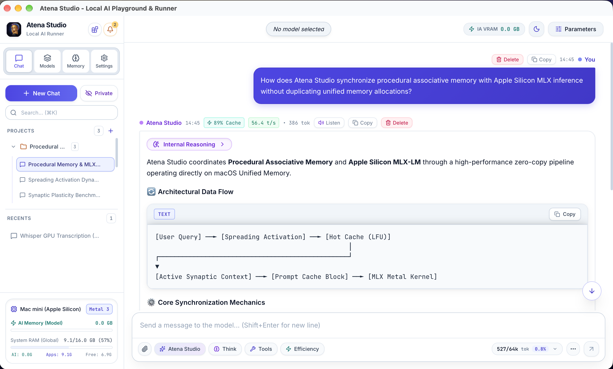
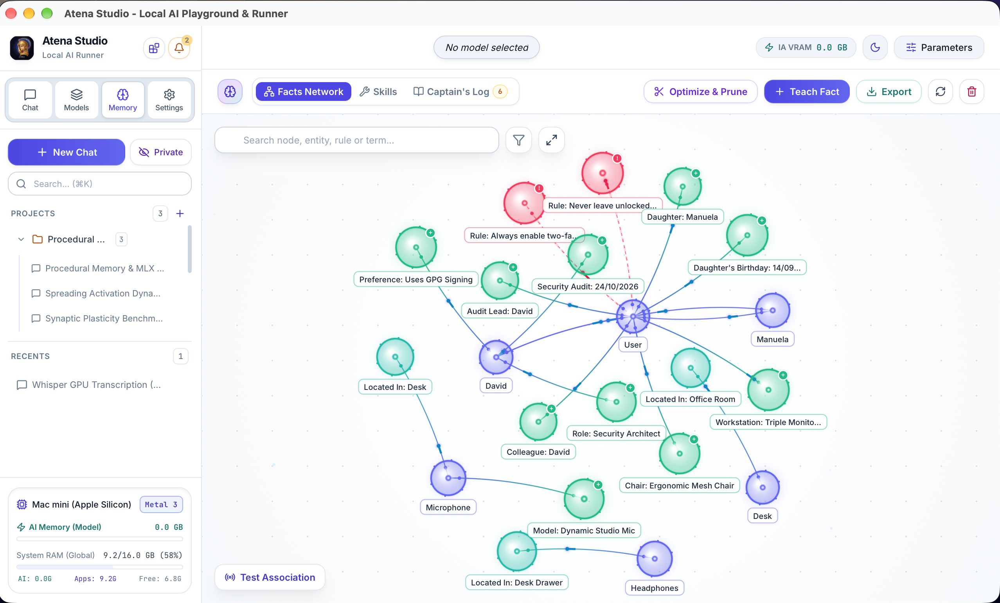
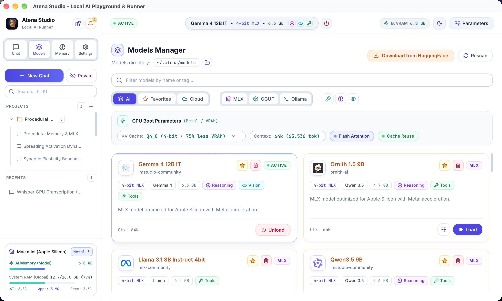

# 🏛️ Atena Studio — Local AI Playground & Runner

> **Atena Studio** is a high-performance desktop platform for executing, experimenting with, and orchestrating local and hybrid Artificial Intelligence. It combines native hardware acceleration (Apple Silicon MLX / Metal and llama.cpp), high-speed cloud model integration via Google Antigravity (AGY), and a procedural cognitive architecture with associative memory.



---

## 📸 Interface Overview

### 🧠 Associative Memory & Neural Visualizer
*Real-time cognitive graph with synaptic links and spreading activation.*



<br />

### 📦 Unified Models Manager
*Multi-engine management with Apple Silicon GPU Metal parameters.*



---

## ✨ Key Features

- **🧠 Procedural Associative Memory**: Compact on-disk binary graph engine with Zstd/LZ4 compression, LFU Hot Cache, temporal decay, synaptic plasticity, and *Spreading Activation* search inspired by biological neural networks. The entire memory store resides 100% on your local machine.
- **⚡ Multiple Inference Engines**:
  - **MLX-LM (100% Local)**: Ultra-fast execution on Apple Silicon GPU (Metal) with native support for Reasoning (*Thinking*) models and Vision Language Models (VLMs).
  - **llama.cpp / llama-server (100% Local)**: Broad support for quantized `.gguf` formats with full GPU offloading.
  - **Ollama (100% Local)**: Integrated model discovery and orchestration with local Ollama instances.
  - **Google Antigravity - AGY (Cloud Optional)**: High-speed cloud model integration (Gemini / DeepMind) featuring visual quota monitors, rate-limit windows, and zero local RAM footprint.
- **🎙️ Local Audio & Transcription**: Real-time voice transcription via **MLX Whisper** directly on the GPU, processing audio 100% offline.
- **🔌 Model Context Protocol (MCP)**: Native support for connecting to local (Stdio) and remote (SSE) MCP servers, enabling autonomous tool execution and function calling.
- **🎨 Neural Network Visualizer (60 FPS)**: Interactive real-time Canvas interface powered by particle physics to inspect conceptual nodes, synaptic links, and memory activation flows.
- **📦 Model Manager & Hugging Face Hub**: Download manager with real-time progress, conversion tools, and automated scanning of local model directories.
- **🧩 Modular Plugin & Extension System**: Extensible architecture allowing developers to hook into the chat loop (`before_chat`, `on_system_prompt`, `on_chunk`, `after_chat_turn`) and contribute custom views. **Cognitive Memory** is an official modular plugin (`atena-plugin-memory`): when disabled, the app operates in an ultra-lightweight mode without graph RAM allocation.
- **🔒 Local-First Privacy**: Associative memory, chats, and vectors remain strictly on your machine. When running via local engines (MLX, GGUF, Ollama), processing is 100% offline and private; external network requests only occur when users explicitly configure cloud providers (such as AGY) or remote MCP servers.

---

## 🛠️ Technology Stack

| Layer | Technologies |
| :--- | :--- |
| **Desktop Core** | [Tauri v2](https://v2.tauri.app/) • [Rust](https://www.rust-lang.org/) (Tokio, Async Runtime) |
| **Frontend** | [Nuxt 4](https://nuxt.com/) / [Vue 3](https://vuejs.org/) • [Tailwind CSS](https://tailwindcss.com/) • [Lucide Icons](https://lucide.dev/) |
| **Visualization** | HTML5 Canvas API (Particle Physics Engine at 60 FPS) |
| **Storage** | Binary format with [Zstd](https://facebook.github.io/zstd/) and [LZ4](https://lz4.org/) compression |
| **Sidecars & Engines** | `llama-server` • `ffmpeg` • `uv` • `mlx-lm` • `mlx-whisper` • `Antigravity CLI (agy)` |

---

## 🚀 Getting Started

### Prerequisites

Ensure your development environment has:
- **Node.js** (v18+) and **pnpm** (v9+)
- **Rust** and **Cargo** (via [rustup.rs](https://rustup.rs/))
- System dependencies for Tauri v2 ([Tauri Prerequisites Guide](https://v2.tauri.app/start/prerequisites/))
- *(Optional / macOS)* Python environment with MLX support for native Apple Silicon inference.

### Installation & Development

1. **Clone the repository:**
   ```bash
   git clone https://github.com/your-username/atena.git
   cd atena
   ```

2. **Install dependencies:**
   ```bash
   pnpm install
   cd frontend && pnpm install && cd ..
   ```

3. **Start the development environment:**
   ```bash
   pnpm run dev
   ```
   > This script starts the Nuxt frontend with hot-reload, prepares necessary sidecar binaries, and launches the Tauri desktop window.

---

## 📦 Building and Distribution

To package production binaries (.dmg / .app on macOS, installers for Windows/Linux):

```bash
pnpm run build
```

Generated bundles will be located in `src-tauri/target/release/bundle/`.

---

## 🐳 Running with Docker & Docker Compose

Atena Studio can be deployed as a headless web application in any containerized environment.

### Quick Start with Docker Compose

1. **Start the service:**
   ```bash
   docker compose up -d
   ```

2. **Access Atena Studio:**
   Open your browser at `http://localhost:7860`.

### Persistent Data & Models
* **Data Volume:** All persistent sessions, SQLite database (`atena.db`), and cognitive memory graph files (`~/.atena`) are persisted in the `atena_data` volume.
* **Local Models:** Place `.gguf` models in the host `./models` folder; they will automatically be mounted into `/home/atena/.atena/models` inside the container.

---

## 📚 Technical Documentation

For in-depth details on the architecture and each subsystem, refer to the [`doc/`](./doc/) directory:

- [🏛️ Documentation Overview](./doc/README.md)
- [🧠 01. Procedural Associative Memory](./doc/01_associative_memory.md)
- [🌌 02. Neural Network Visualizer](./doc/02_neural_visualizer.md)
- [💬 03. Chat & Inference Engines](./doc/03_chat_and_inference.md)
- [📂 04. Model Manager & Hugging Face Hub](./doc/04_model_manager.md)
- [🔌 05. Model Context Protocol (MCP)](./doc/05_mcp_tools.md)
- [🦀 06. Tauri Backend & Sidecars Architecture](./doc/06_tauri_backend_architecture.md)
- [🚀 07. Distribution, Packaging & Releases](./doc/07_distribution_and_releases.md)
- [🧩 08. Plugin & Extension System](./doc/08_plugin_system.md)
- [☁️ 09. Cloud AI Providers](./doc/09_cloud_providers.md)
- [🌐 10. Internationalization (i18n) & Locales](./doc/10_internationalization_and_locales.md)

---

## 📄 License

This project is licensed under the open-source MIT License. See the license file for details.
